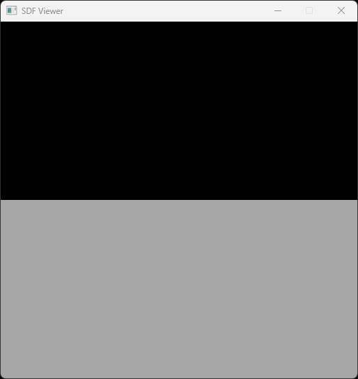
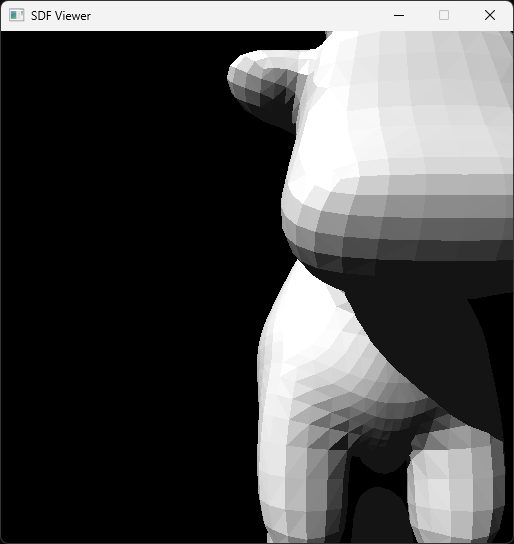
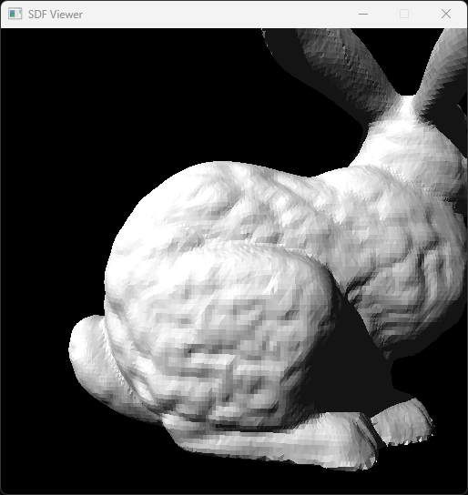
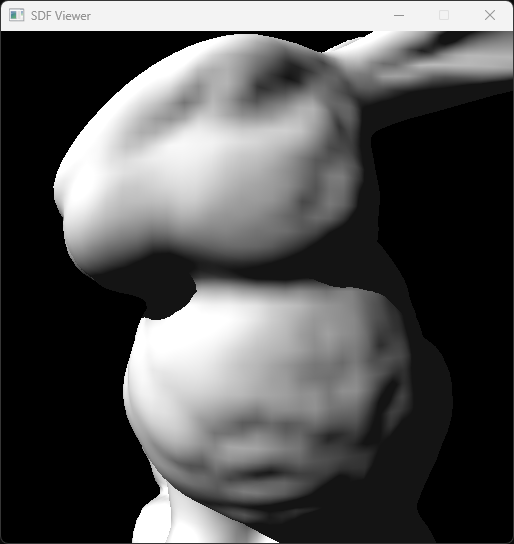
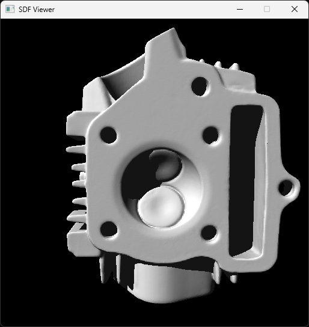
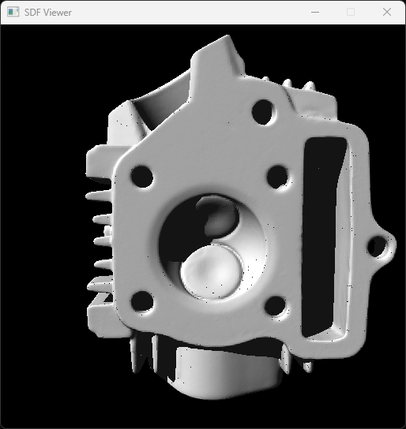

# SoftwareRayTracer
Программа написана на первом курсе магистратуры. Многопоточный программный рендер с трассировкой лучей на C++. Код представлен в виде проекта для Visual Studio. Все необходимые библиотеки уже содержатся в репозитории.

**Поддерживаются следующие режимы работы:**
1) Рендер плоскости, заданной уравнением ```SoftwareRayTracer.exe plane x y z d```. Пример ```SoftwareRayTracer.exe plane 0 1 0 0```  

3) Наивный рендер полигональной модели ```SoftwareRayTracer.exe mesh_no_bvh file_name```. Пример ```SoftwareRayTracer.exe mesh_no_bvh files\spot.obj```  

4) Рендер полигональной модели с использованием ускоряющей структуры LBVH ```SoftwareRayTracer.exe mesh_bvh file_name```. Пример ```SoftwareRayTracer.exe mesh_bvh files\bunny.obj```  

5) Построение ускоряющей структуры SDF Grid на основе полигональной модели ```SoftwareRayTracer.exe mesh_to_grid size input_file_name output_file_name```. Пример ```SoftwareRayTracer.exe mesh_to_grid 256 files\spot.obj files\spot.grid```
6) Рендер полигональной модели, представленной структурой SDF Grid ```SoftwareRayTracer.exe grid file_name```. Пример ```SoftwareRayTracer.exe grid files\example_grid.grid```  

7) Построение ускоряющей структуры SDF Octree на основе полигональной модели ```SoftwareRayTracer.exe mesh_to_octree depth input_file_name output_file_name```. Пример ```SoftwareRayTracer.exe mesh_to_octree 5 files\spot.obj files\spot.octree```
8) Рендер полигональной модели, представленной структурой SDF Octree ```SoftwareRayTracer.exe octree_sphere_tracing file_name```. Пример ```SoftwareRayTracer.exe octree_sphere_tracing files\example_octree_large.octree```  

9) Рендер полигональной модели, представленной структурой SDF Octree, с помощью аналитического поиска пересечения вместо sphere tracing ```SoftwareRayTracer.exe octree_analytic file_name```. Пример ```SoftwareRayTracer.exe octree_analytic files\example_octree_large.octree```  


**Управление:**
- WASD для перемещения камеры
- QZ для движения вверх и вниз
- стрелки для поворота камеры
